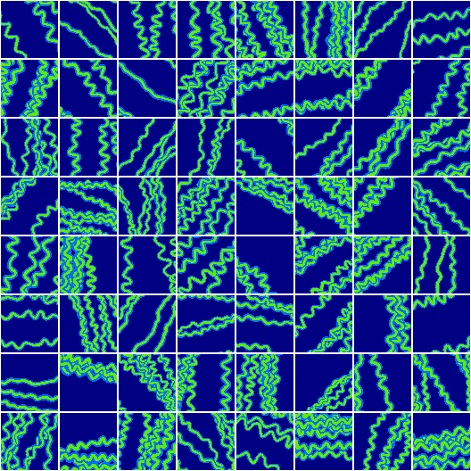
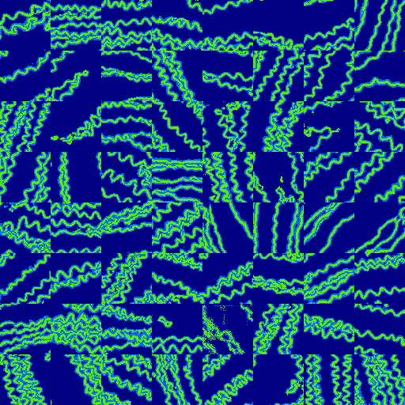
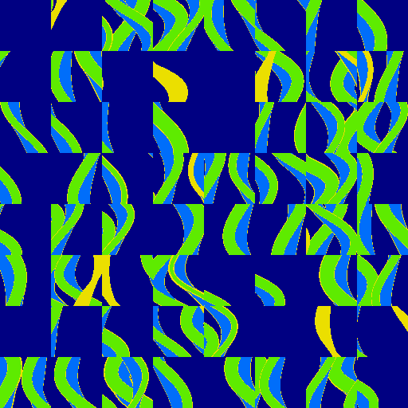
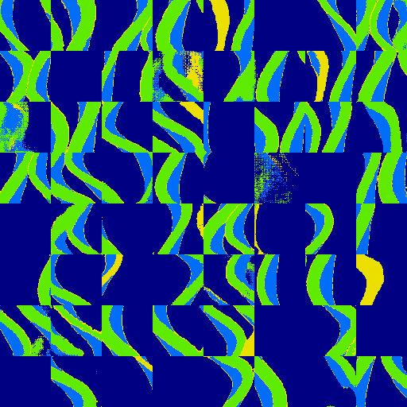

# Facies modeling with GANs

Underground facies (= kind of rocks) modeling with GANs.


[](https://stringfixer.com/fr/MIT_license)


[](https://github.com/valentingol/gan-facies-modeling/actions/workflows/flake.yaml)
[](https://github.com/valentingol/gan-facies-modeling/actions/workflows/pydocstyle.yaml)
[](https://github.com/valentingol/gan-facies-modeling/actions/workflows/mypy.yaml)
[](https://github.com/valentingol/gan-facies-modeling/actions/workflows/isort.yaml)
[](https://github.com/valentingol/gan-facies-modeling/actions/workflows/pylint.yaml)

---

Date: 2022-07-20

Author: [github@Valentingol](https://github/valentingol.com)

[](https://github.com/valentingol)
[](https://github.com/valentingol)

---

## Available models

**2D Models:**

- `sagan` - Unconditional SAGAN (based on
[Self-Attention Generative Adversarial Networks](https://arxiv.org/abs/1805.08318)
and [Modeling of subsurface sedimentary facies using SAGANs](https://www.sciencedirect.com/science/article/abs/pii/S0920410522003540))

**3D Models:**

- soon 🚧

## Examples

### GANSim dataset

| 
|:--:|
| **Real Images**|

| 
|:--:|
| **Generated Images**|

### Stanford-VI dataset (first part)

| 
|:--:|
| **Real Images**|

| 
|:--:|
| **Generated Images**|

## Quick start

### Installation

Install the module and dependencies in a virtual environment with Python 3.8-3.10:

```bash
pip install -e .
pip install -r requirements.txt
```

### Train on a dataset

A small dataset is available by default in this repository. It contains 2000
synthesized images representing some channels and 3 kind of facies and was
generated in the [GANSim project](https://github.com/SuihongSong/GeoModeling_GANSim-2D_Condition_to_Well_Facies_and_Global_Features)
(under [MIT license](./assets/third_party_licenses/GANSim%20MIT%20LICENSE)).
More synthesized data are available
[here](https://zenodo.org/record/3993791#.X1FQuMhKhaR).

Of course, you can put your own dataset in the `datasets` folder. The dataset
should be a Numpy (`.npy`) file containing a 3D ndarray with format
(z~depth~n_samples, y, x) of type `uint8` with a different number for each
facies, starting from 0. The number of facies is then `dataset.max() + 1`.

Now you can simply run a train on the default dataset with unconditional SAGAN
model using the following command:

```bash
python apps/train.py
```

You can see the progress of the training in the terminal and the resulted
images and trained networks in the `res` folder.

This repository contains a lot of configurations to customize the training and
will be explained in the next section.

## Configurations

Of course it is always interesting to customize the training with flexibility.
Thus this repository use the smart configuration manager
[rr-ml-config-public](https://gitlab.com/reactivereality/public/rr-ml-config-public).

The default sub-configurations (for models, training, ...) are organized in
different sub-folders in `configs/default`. You can launch an experiment by
writing an other configuration `.yaml` file that will be merged with the
default one. Some examples are available in `configs/exp`. For example,
this will override the default value of the name of the run and discriminator
learning rate to 0.001:

```yaml
# configs/exp/my_experiment.yaml
run_name: my_experiment
training.d_lr: 0.001
```

Then you can run the experiment by adding the configuration in command line.

```bash
python apps/train.py --config configs/exp/my_config.yaml
```

*Note: The space between the `--config` and the configuration file is important.*

You can also put instead a **list** of configuration paths to merge together
several experiment files (from the begin of the list to the end).

Moreover you can override parameters also by adding them in the **command line**.
For example this will override the default configuration with your experiment
configuration, then set the generator learning rate to 0.001 and the generator
random input dimension to 64:

```bash
python apps/train.py --config configs/exp/my_config.yaml --training.g_lr=0.001 --model.z_dim=64
```

*Note: The `=` between the `--param` and the value is important.*

Finally, the configurations will be automatically saved (by default in `configs/runs`)
to ensure that you can always recover the exact configuration used for the runs.
The "hierarchy of merging" is also saved to understand quickly how the configuration
was merged (with what experiment file(s) and what command line parameters).

## Experimental Tracking : Weights and Biases and ClearML support

[Weights and Biases](https://wandb.ai/site) (WandB) and [ClearML](https://clear.ml/)
are two very popular platform of ML experience tracking, used to visualize the
logs of a training session (curves, generated images, ...),
compare the results of different runs and different configurations, reveal the
more interesting parameters and many utilities to explore parameters space
(collaboratively or not), etc.

This repository allows to use WandB and ClearML very simply. You can check the default
configuration implying WandB in `configs/default/wandb.yaml` and ClearML in
`configs/default/clearml.yaml`. To use Wandb or ClearML you need to install
one of them, create an account if you don't have one and set the configuration
`wandb.use_wandb: True` or `clearml.use_clearml: True` in addition to the parameters
for initialize the WandB run or ClearML task.

Plus, you can explore the parameters space using `wandb.sweep`. To do so, you
simply need to create a sweep config such as in `configs/sweep/ex_sweep.yaml`
and set `wandb.sweep_config_path: <path/to/sweep/file>`.

Some examples (using wandb without and with sweep and ClearML) are available
in `configs/exp`.

Note:

- It is currently not possible to use both ClearML and WandB at the same time
- It is currently not possible to use hyperparameter search with ClearML in
this repository (🚧)

## TODO list

- [x] Add test for generator in `apps/train.py`
- [x] Add generated results on GANSim dataset and
[Stanford VI dataset](https://github.com/SCRFpublic/Stanford-VI-E/tree/master/Facies)
- [ ] Hyperparameter search with ClearML
- [ ] Add conditional SAGAN
- [ ] Add 3D models
- [ ] Explore other architectures

## How to contribute

Please have a look on [CONTRIBUTE.md](./CONTRIBUTE.md). Thank you very much! 🙏
