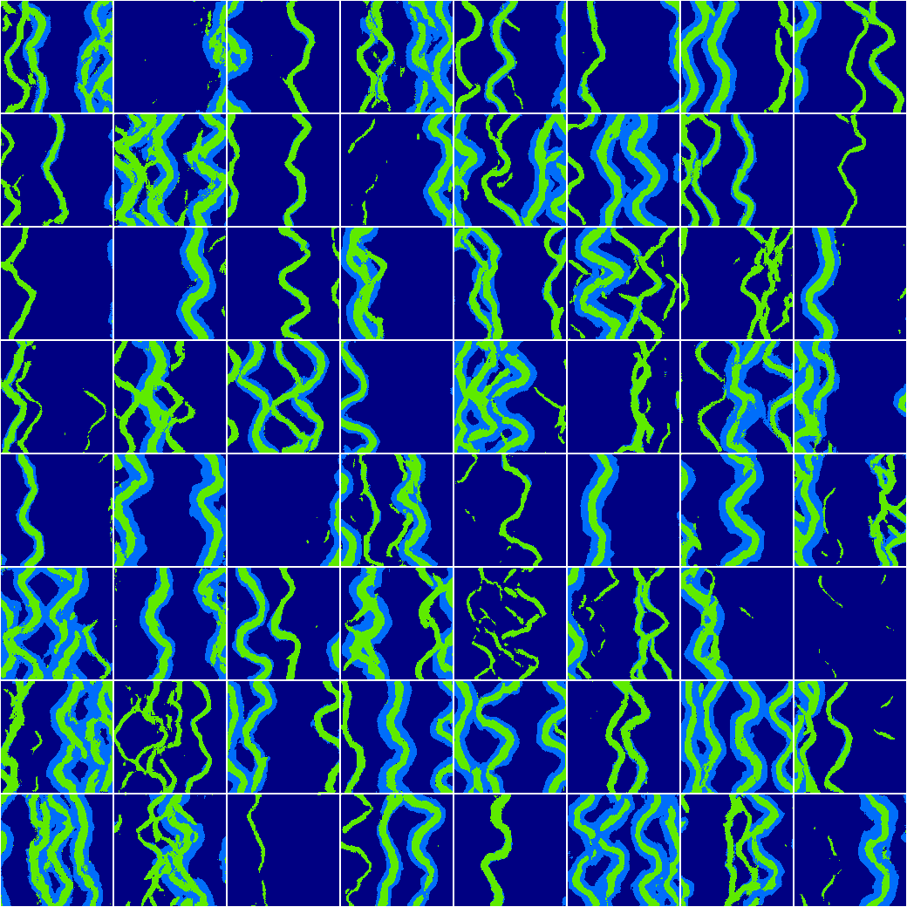
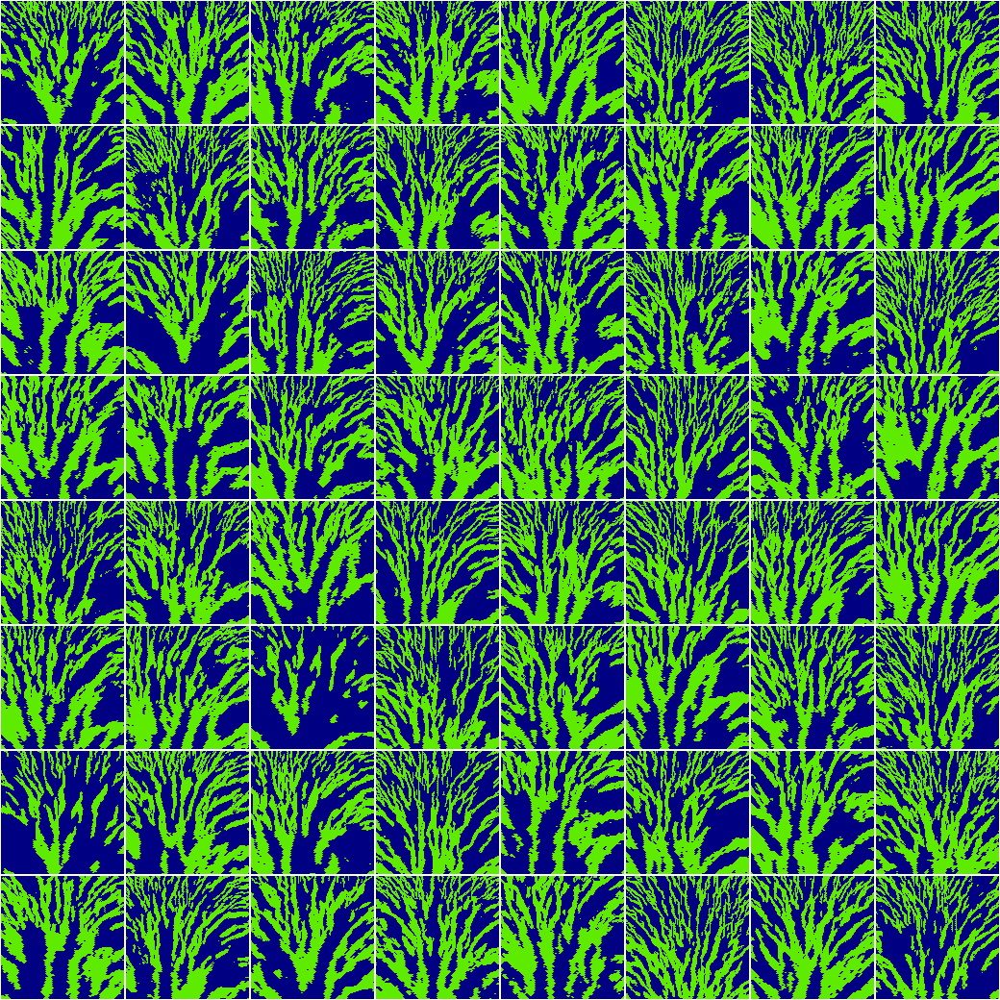
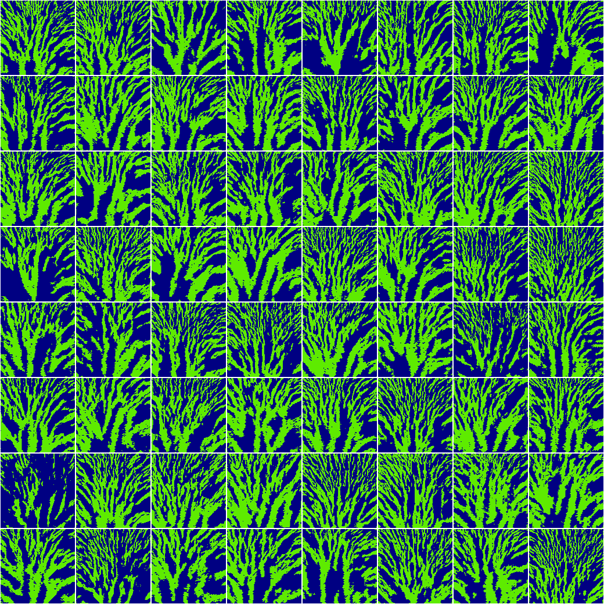

# Facies modeling with GANs

Underground facies (= kind of sediment) modeling with GANs.

**Disclaimer**: This repository is a work in progress. This code aims to be the
official implementation of a not already published research paper. It provides
a complete code to train and evaluate some GANs for facies modeling as well as
unit tests and a small ready-to-use dataset (see below).


[](
    https://stringfixer.com/fr/MIT_license)


[](
        https://github.com/valentingol/gan-facies-modeling/actions/workflows/flake.yaml)
[](
    https://github.com/valentingol/gan-facies-modeling/actions/workflows/pydocstyle.yaml)
[](
    https://github.com/valentingol/gan-facies-modeling/actions/workflows/mypy.yaml)
[](
    https://github.com/valentingol/gan-facies-modeling/actions/workflows/isort.yaml)
[](
    https://github.com/valentingol/gan-facies-modeling/actions/workflows/pylint.yaml)

---

Date: 2022-07-20

Author: [github@Valentingol](https://github.com/valentingol)

[](
    https://github.com/valentingol)
[](
    https://github.com/valentingol)

Work during my 5 months internship at [IFPEN](https://www.ifpenergiesnouvelles.com/),
supervised by [UVSQ](https://www.uvsq.fr/english)
and financed by [DATAIA Paris Saclay](https://dataia.eu/en/dataia-paris-saclay-institute).

Copyright © 2022 Goldite Valentin

MIT License ([see here](LICENSE.md))

---

## Available models

**2D Models:**

- `sagan` - Unconditional SAGAN (based on
[Self-Attention Generative Adversarial Networks](https://arxiv.org/abs/1805.08318)
and [Modeling of subsurface sedimentary facies using SAGANs](
    https://www.sciencedirect.com/science/article/abs/pii/S0920410522003540))

- `cond_sagan` - Conditional SAGAN (based on
papers above
for SAGAN part and
[GANSim: Conditional Facies Simulation Using an Improved Progressive Growing of GANS](
    https://ideas.repec.org/p/osf/eartha/fm24b.html)
for conditional part) that also reconstructs input pixel maps

Note that you can disable self-attention in the configurations (similar to
DCGAN architecture).

## Quick start

### Installation

Install the module and dependencies in a virtual environment with Python 3.7-3.10.
Using Linux or WSL is recommended to use [JAX](https://github.com/google/jax)
for faster metrics computation but it is not mandatory.

```bash
pip install -e .
pip install -r requirements.txt
# dependencies without JAX (windows users):
pip install -r requirements-nojax.txt
# for developers:
pip install -r requirements-dev.txt
```

### Train on the default dataset

A small dataset is available by default in this repository. It contains 2000
synthesized images representing some channels and 3 kind of facies and was
generated in the [GANSim project](https://github.com/SuihongSong/GeoModeling_GANSim-2D_Condition_to_Well_Facies_and_Global_Features)
(under [MIT license](./assets/third_party_licenses/GANSim%20MIT%20LICENSE)).

You can simply run a train on the default dataset with unconditional SAGAN
model using the following command in `gan_facies` folder:

```bash
python gan_facies/apps/train.py
```

You can see the progress of the training in the terminal and the resulted
images and trained networks in the `res` folder.

More data are available in this repository. Simply extract `datasets/datasets.zip`
in the `datasets` folder. It contains a bigger version of the GANSim dataset as
well as [Rongier et al. (2016)](https://hal.archives-ouvertes.fr/hal-01351694/) dataset.

**If you use this dataset in your work, please cite the original authors.**

## Use your own dataset

Of course, you can use your own dataset. Simply drop it in the `datasets` folder.
The dataset should be a Numpy file (`.npy`) containing a 3D ndarray with format
(z/depth/n_samples, y, x) of type `uint8` with a different number for each
facies, starting from 0. The number of facies is then `dataset.max() + 1`.
Now tou can run the training adding the `--dataset_path=<mypath>` argument.
You can also change the dataset path via configuration files. The next section
explains how to do that.

## Configurations

It is always interesting to customize the training with your own configurations.
This repository contains a lot of configuration organized in multiple sub-configurations.
The management of the configurations is simply done thanks to the smart configuration
manager [YAECS](https://github.com/valentingol/yaecs).

The default sub-configurations (for models, training, ...) are organized in
different json files in `configs/default`. You can launch your own experiment by
writing a new `.yaml` file that will be merged with the default configuration.
Some examples are available in `configs/exp`. For example, the following file
will override the default value of the name of the run as well as discriminator
learning rate to 0.001:

```yaml
# >> file 'configs/exp/my_config.yaml'
run_name: my_experiment
training.d_lr: 0.001
```

Then you can run the experiment by adding the configuration in command line.

```bash
python gan_facies/apps/train.py --config gan_facies/configs/exp/my_config.yaml
```

*Note: The space between the `--config` and the configuration file is important.*

Moreover you can override parameters also by adding them in the **command line**.
For example this will override the default configuration with your experiment
configuration, then set the generator learning rate to 0.001 and the generator
random input dimension to 64:

```bash
python gan_facies/apps/train.py --config gan_facies/configs/exp/my_config.yaml --training.g_lr=0.001\
 --model.z_dim=64
```

*Note: The `=` between the `--param` and the value is important.*

To use conditional model you can check the `configs/exp/conditional.yaml` file
and adapt it to your needs. An other way is to use the merging of configurations
in cascade provided by yaecs. In fact, if you can put **list** of configuration
file for `--configs`, they will be merge together (from the begin of the list
to the end). Example:

```batch
python gan_facies/apps/train.py --config [gan_facies/configs/exp/models/cond_sagan.yaml,gan_facies/configs/exp/my_config.yaml]
```

First `configs/exp/models/cond_sagan.yaml` will be merged (changing model configuration)
then `configs/exp/my_config` (overwriting model configuration if needed).
You can create your own specific configurations (for data, models, metric, ...)
and merge as many of them as you want.

Finally, the configurations will be automatically saved (by default in `res/configs`)
to ensure that you can always recover the exact configuration used for the runs.
The "hierarchy of merging" is also saved to understand quickly how the configuration
was merged (with what experiment file(s) and what command line parameters).

**A description of all configuration parameters is available in `CONFIG_SUMMARY.md`.**

## Experimental Tracking : Weights and Biases and ClearML support

[Weights and Biases](https://wandb.ai/site) (WandB) and [ClearML](https://clear.ml/)
are two very popular platform of ML experience tracking, used to visualize the
logs of a training session (curves, generated images, ...),
compare the results of different runs and different configurations, reveal the
more interesting parameters and many utilities to explore parameters space
(collaboratively or not), etc.

This repository allows to use WandB and ClearML very simply. You can check the default
configuration implying WandB and ClearML in `configs/default/experiment_tracking.yaml`.
To use Wandb or ClearML you first need to install them, create an account if
you don't have one and set the configuration `wandb.use_wandb: True` or
`clearml.use_clearml: True` in addition to the parameters for initialize
the WandB run or ClearML task.

Plus, you can explore the parameters space using `wandb.sweep`. To do so, you
simply need to create a sweep config such as in `configs/sweep/ex_sweep.yaml`
and set `wandb.sweep_config_path: <path/to/sweep/file>`.

Some examples (using wandb without and with sweep and ClearML) are available
in `configs/exp`.

Note:

- It is currently not possible to use both ClearML and WandB at the same time
- It is currently not possible to use hyperparameter search with ClearML
  (only with wandb sweep). But we welcome any contribution to add this feature
  (see [`CONTRIBUTE.md`](CONTRIBUTE.md))

## Examples of generated images

### GANSim dataset

| 
|:--:|
| **Real Images**|

| 
|:--:|
| **Generated Images** (128 $\times$ 128)|

### TI Analog dataset [Rongier, 2016]

| 
|:--:|
| **Real Images**|

| 
|:--:|
| **Generated Images** (128 $\times$ 128)|

### Stanford-VI dataset (deltas)

| 
|:--:|
| **Real Images**|

| 
|:--:|
| **Generated Images** (128 $\times$ 128)|

## TODO list

- [x] Add test for generator in `apps/train.py`
- [x] Add generated results on GANSim dataset and
[Stanford VI dataset](https://github.com/SCRFpublic/Stanford-VI-E/tree/master/Facies)
- [x] Add conditional SAGAN
- [ ] Add images generated by conditional model and metrics in README
- [ ] Add 3D models

## How to contribute

We welcome any contribution to improve this repository. Please have a look on
[CONTRIBUTE.md](./CONTRIBUTE.md). Thank you very much! 🙏
